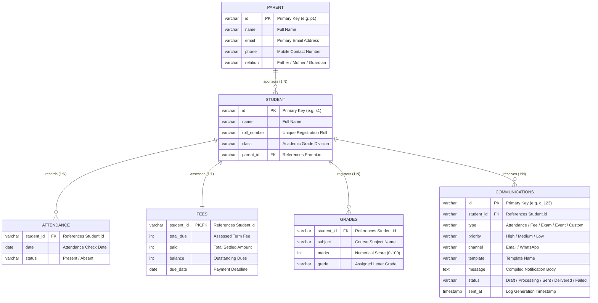

# Relational Database Schema & Entity-Relationship Diagram (ERD)

This document outlines the relational database structure designed to support student record tracking, academic performance indicators, financial transactions, and multi-channel notifications.

---

## 1. Entity-Relationship Diagram (ERD)

---

## 2. Integrity & Validation Rules

To prevent data corruption, the system applies the following client-side and server-side validation models before inserting database updates:

1. **Email Integrity**: Matches regex: `^[a-zA-Z0-9._%+-]+@[a-zA-Z0-9.-]+\.[a-zA-Z]{2,}$`
2. **Phone Number Format**: Must include country code prefixes (e.g. `+91` or `+1`) to ensure Twilio or message API compatibility.
3. **Attendance Status Domain**: Restricted strictly to standard enum options: `['Present', 'Absent']`.
4. **Grading Boundary**: Scores in `GRADES` must range within the interval `[0, 100]`.
5. **Fee Balance Constraint**: Always verified programmatically as `balance = total_due - paid`.
6. **Communication Pipeline Bounds**: Status fields must transition logically:
   $$\text{Draft} \longrightarrow \text{Processing} \longrightarrow \text{Sent} \longrightarrow [\text{Delivered} \mid \text{Failed}]$$
